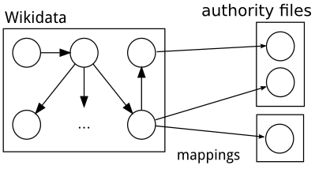

---
title: Collaborative creation of a Wikidata handbook
author:
- name: Jakob Voß
  refaddr:
  - Hochschule Hannover / Verbundzentrale des GBV
  - Hannover / Göttingen
  email: jakob.voss@gbv.de
date: 2014-04-30
doi: 10.5281/zenodo.11249
category:
- '\category{I.7.1}{Document and Text Processing}{Document and Text Editing}[version control]'
- '\category{I.7.2}{Document and Text Processing}{Document Preparation}'
about: '[OpenSym 2014](http://opensym.org/os2014/) (formerly WikiSym) will be held in Berlin on August 27-29. Call for paper deadline is May 4th. This article is going to be submitted to the [Community Track](http://www.opensym.org/os2014/submission/community-track-call/). Short experience reports may be 2-4 pages long, long experience reports may be 5-10 pages long.'
abstract: This article describes the theoretical and practical background of a collaborative writing project resulting in a handbook on Wikidata and authority control. The handbook was created by an untrained group of students during three month in spring 2014. It was written in Pandoc Markdown in a git repository at Penflip.com.
permission: You are free to share and adapt this document for any purpose.
copyright: Closed Access ACM proceedings version to be published with DOI http://dox.doi.org/10.1145/2641580.2641631. This version CC0 Jakob Voß
conference:
  short: Opensym (WikiSym) '14
  full: August 27-29, 2014, Berlin, Germany
...

# Introduction

In the two years of its existence Wikidata^[<https://www.wikidata.org>] has become a central part of the Wikimedia projects [@Vrandecic2014]. In a nutshell, Wikidata is a multi-lingual database, but it's not easy to grasp what this actually means. The internal documentation of Wikidata is complex and incomplete, especially in other languages but English. This article describes the collaborative creation of a German documentation of Wikidata with focus on authority control in Wikidata. The experience report will first introduce Wikidata and collaborative writing in general, followed by the more specific topic of the resulting handbook. It will then describe organization and tools of creation and conclude with results and lessons learned.

## Wikidata

Wikidata is an open knowledge base operated by the Wikimedia Foundation. It was started in 2012 to support the other Wikimedia projects such as Wikipedia, Wikisource, and Wikibooks with a central, multilingual database. Contributions to the database are likewise possible by anyone in virtually any language. As of spring 2014, parts of Wikidata functionality are still being implemented. By then Wikidata includes names, numbers, connections and other structured data about more than 15 million objects. Despite its growing importance, Wikidata is not widely known, expect among Open Data enthusiasts, and its multilingual documentation can be quite confusing. This shortage is apperent for several reasons: first, the documentation is created by a volunteers without deadlines trying to describe a moving target in multiple languages in parallel. Second, structured data -- the subject matter of Wikidata -- is no familiar concept to most people. Quite the contrary, multiple notions of data are often confused [@BallsunStanton2012; @Voss2013] so it's not obvious what kind of database Wikidata actually is. 

From a library and information science point of view, at least parts of Wikidata resemble an authority file: Wikidata records about objects, entities, or concepts are called *items*. Each item can have at most one preferred *label* per language and multiple alternative labels (*aliases*). Items can further have scope notes (*descriptions*) and *statements*. The latter are what makes Wikidata a knowledge base: a statement is kind of an enriched key-value pair with controlled fields as *properties*. Statement can either assign values to items (e.g. a literals, numbers, coordinates...) or connect items with each other. Statements can further be contextualized with *qualifiers*, *ranks*, and *references*.

## Collaborative Writing

The principle of collaborative writing has been familiar to Wikipedia authors and open source developers since more than a decade. The first wave of online writing tools, during the rise of Web 2.0, focused on wikis with Wikipedia as most popular example. Meanwhile wiki functionalities are common and more specialized applications have evolved. This development is driven by progress in web application technologies and by establishment of the internet as ubiquuus medium. Cloud services facilitate access to documents from any location and revision control systems such as git become known and used also outside of software development. Easy access and tracking changes are core features of all collaborative writing tools. Several of these tools exist or are being developed (Google Docs/Drive, Etherpad, Penflip, Typewrite, and Fidus Writer to name some). Recent overviews have been given by [@Schreiber2014] and by [@Schoch2014] but the current state of collaborative writing is very dynamic.

The creation of knowledge artifacts by collaborative writing is becoming more and more common also among scholars [@Heller2014]. One example of new practices and processes that evolve around this trend is called *book sprint*. A book sprint is an event that brings together a group of experts to create a book in a few days. The book is made available immediately at the end of the sprint as ebook and/or print-on-demand.

# Topic of the handbook

The Bachelor's degree in information management at Hannover University of Applied Sciences and Art (HsH) includes a project conducted during one semester in supervised groups of eight to ten students. The general goal of the student project is to learn and practice basic concepts of project management. In spring 2014 a project titled "Normdaten in Wikidata" (German for "authority control in Wikidata") was offered with the following the following objective:

* creation of a handbook of Wikidata
* comprehensibly written in German
* focus on authority control in Wikidata
* publishing as ebook in HTML, PDF, and printed

The particular task required to familiarize with a new and exciting topic (Wikidata) and to get into the whole process of creating a book, including media-neutral publishing. 

## Authority control in Wikidata

The focus on authority control in Wikidata was chosen to highlight an aspect of Wikidata much relevant to information management. As mentioned above, parts of Wikidata also resemble an authority file such as classifications, taxonomies and other controlled vocabularies used in cataloging and indexing. A deeper look reveals that many statements in Wikidata refer to other authority files. For instance the property `P1036`^[<https://www.wikidata.org/wiki/Property:P1036>] is used to state the notation of Dewey Decimal Classification (DDC) that corresponds to a Wikidata item. This notation can then be used to find related documents in library catalogs. By now, Wikidata contains more then 150 properties for mapping Wikidata items to other authority files via their identifiers (figure 1). 

Mappings between authority files are important for interoperability, especially in cultural heritage institutions. The largest hub of such mappings can be found in project VIAF^[<http://viaf.org>], including links to Wikipedia. Authority mappings between Wikipedia and other sources are common also to provide additional links [@Voss2011]. By inclusion and extension of these mappings, Wikidata becomes both, an authority file in its own right, and a hub for (inter)linking authority files.

# Organization and tools

Nine students were assigned to the project to create a German Wikidata handbook with focus on authority control. Beginning from March we met once a week for 5 hours the following 14 weeks (with a break on easter holidays).^[The project still going on at the time of writing this article.] Given that none of the students hat prior knowledge of Wikidata or serious collaborative writing in general, this time is comparable with a typical book sprint lasting 4 to 5 full days. Depending on the particular task the group was divided into smaller teams work or the book was created self-organized during the meetings. The project started with a brief introduction to project management, Wikidata and the aspired topic of the handbook. First ideas for content and outline were collected by using the design studio method [@Ungar2008]. 

~~~ {.dot .dpi=300 .scale=60% .title=technical workflow}
digraph {
  rankdir=LR;
  Penflip->git;
  git->HTML[label=Pandoc];
  git->PDF[label=Pandoc];
}
~~~

The technical workflow (figure 2) was set up by the supervisor and later extended to ensure a build process from the beginning. In the end, the following tool were used:

* Penflip^[<https://penflip.com>] for collaborative writing
* Pandoc^[<http://johnmacfarlane.net/pandoc/>] to build the book in several output formats
* Trello^[<https://trello.com>] for project management
* GitHub^[<https://github.com>] for hosting snapshots
* Annotator^[<https://annotatorjs.org>] for distributed proofreading

## Penflip and Pandoc

The collaborative writing platform Penflip was chosen primarily because it uses Markdown syntax for text markup and git to store files and revisions. Markdown is a human-readable, lightweight markup language,  invented by John Gruber und Aaron Swartz. It is used in many applications as popular alternative to HTML and other forms of wiki syntax. Several extensions to Markdown exist with Pandoc Markdown as most powerful instance. Pandoc is an open source software created by John MacFarlane to convert between different types of markup formats (HTML, LaTeX, DocBook, MediaWiki...). It extends Markdown by features such as tables, footnotes, and references. It has been proposed to further extend the Pandoc document model [@Krijnen2014], but one of its strength is the limitation to a fixed set of possible document elements. This "less is more" principle of features also applies to Penflip [@Burton2014]. Git is a distributed revision control originally created by Linus Torvalds. GitHub is probably the most popular service to share and collaborate in git repositories. Penflip also provides git hosting but its aim and user interface are better designed for writing text documents in Markdown syntax. Loren Burton, the creator of Penflip also referred to his product as kind of "GitHub for writers".

## Trello and Annotator

Trello was chosen for project management because it is free and easier to understand and use than more elaborated products such as MS Project. Moreover there is both, a web application and an Android client. Annotator is a project of the Open Knowledge Foundation to add annotation functionality to any webpage. It is used during final stage of the project to support easier feedback and corrections in addition to git, and to just try out a new exciting technology.

# Result

The resulting handbook will be made available^[<https://penflip.com/nichtich/normdaten-in-wikidata> points to the most recent version of the book.] licensed as CC-BY-SA. A printed version can be obtained via print on demand [@Voss2014]. In A5 format it is around 70 pages, including a glossary, bibliography and a full list of Wikidata authority properties. Despite the focus on authority control in Wikidata, large parts of the book can be reused for general introductions to Wikidata as well.

# Findings and lessons learned

The participants of the project learned a lot about Wikidata, authority control, and project management. The latter, however, could only be practiced in limited form because supervisor, client, and project leader were the same person. We tried agile development to some degree, although this concept from software engineering is not fully applicapable to a book sprint. To support agility in creating the book, it is important to ensure a build process that always results in a full version. The required coupling of Penflip and Pandoc was finally achieved by a cronjob and Makefile to build the current HTML and PDF every quarter an hour. Trello was very easy to use and sufficient to keep track of todo lists, but links between items in Trello and sections of the handbook had to be managed manually. As the outline of the book evolved during the project, text had to be rearange and moved around. This typical task in creation of a long text is poorly supported by any collaborative writing system, including Penflip. In some cases it was easier to temporarily copy & paste text into a local editor instead of using the web interface. Penflip is still very new, so it has some usability and stability issues, but it suited our needs. In particular, the complexity of git is hidden well to the users, unless there is a merge conflict. The collaborative writing platform could further be extended by support of live editing, such as in Etherpad, and by better support of Pandoc Markdown features. Annotator is an easy method of annotation but neither fully stable at the time of writing. Especially annotating changing documents seems to be an unsolved problem.

Finally, the topic of the book is evolving quickly as well. When getting to know Wikidata, it was not always clear which features are planned, which are implemented, and which are actually used in practice. Both, the abstract nature of the database, and its interlinguality made it difficult to find and describe all relevant aspects of Wikidata. The result of this project shall improve the documentation of Wikidata with a consistent introduction, at least in German.

# Summary

As demonstrated with this project, it is possible to complete a book sprint as university course with an untrained group of students in a limited amount of time. At least one person familiar with the topic of the book is crucial, though. A mixed group of students and experts may further improve the creation of similar handbooks. The tools (Penflip, git, Pandoc, Trello, and Annotator) are powerful for collaborative writing and media neutral publishing. Nevertheless, usability and integration of tools can still be improved. We hope that others and Wikidata can not only benefit from the result of the project but also from the process and lessons learned.

# References
